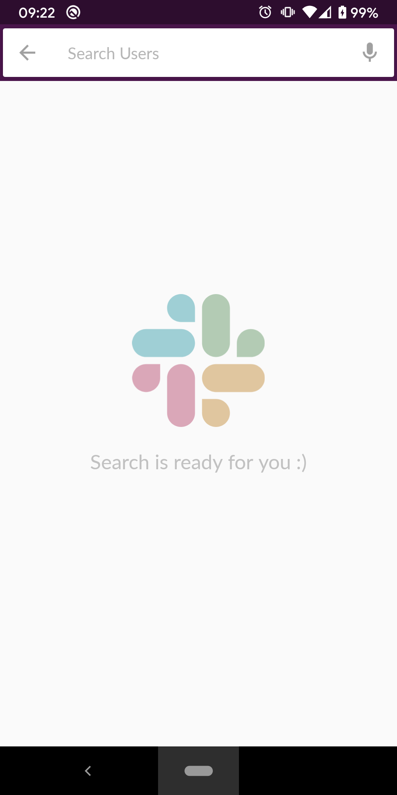
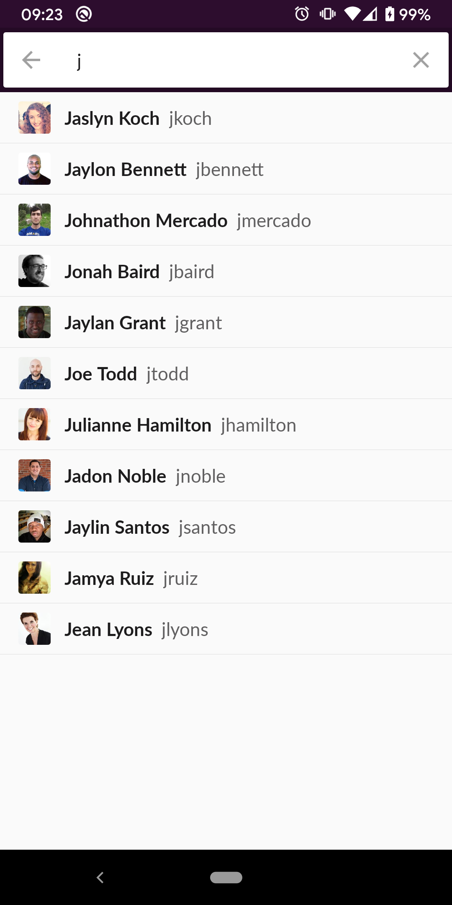
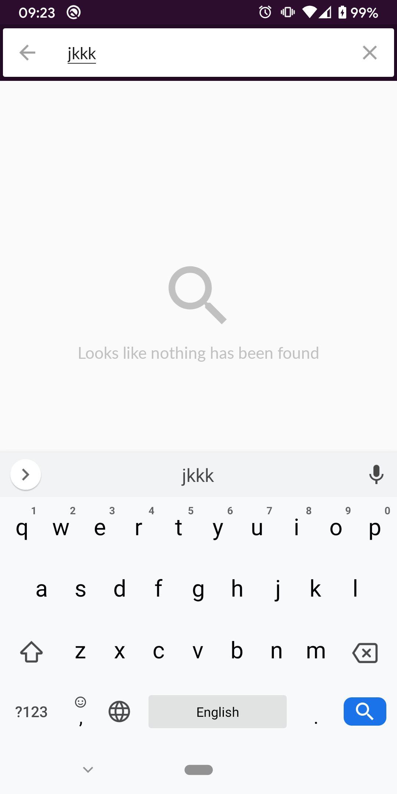

# android-code-exercise

 
 

Libraries added:

            material        : '1.1.0',
            constraint      : '2.0.0-beta4',
            testRules       : '1.3.0-alpha04',
            picasso         : '2.71828',
            mockito         : '3.0.0',
            psvVersion      : '1.1.2',
            room            : '2.2.4'

## Project improvements highlights:
 - Updated UI by adding PersistentSearchView library for search view 
 - Added Room Library for offline capabilities. All searched data is automatically saved to the DB and can be searched without network connection. ACCESS_NETWORK_STATE permission was added to detect network connection state: If no network connection detect, application will load last search results, but searching is also available for in offline based on previously saved data. If no results will be found for online and offline user will see different messages accordingly
 - I used Picasso Image Loading library as I had good experience with this library in the past. I created ImageLoader interface that is using in the app, so in future it should be easy to replace with any other library. 
 - Improve dependency injection by adding ability to reference Application Context in Singletons
 - Added Unit and Espresso tests to cover basic functionality of the app. If needed It would be easy and fun to write unit tests for UserSearchPresenter since all dependencies are provided via constructor
 - Improved UserSearchResultDataProviderImpl where previously it was only referencing SlackApi, but not it works both with API and DB integration. Also added RxSchedulersProvider that will allow to replace schedulers for the tests with Rx Java
 - Added kotlin-allopen plugin that allows to make kotlin non-final classes for testing. Currently @OpenClass annotation works for both prod and debug, but if needed it can applied only for debug build.  
  
## Here are project commits highlights:

### Improve Search view results layout

  - adjust item_user_search layout by adding userAvatar and name views
  - adjust styles for list name and username
  - add divider styling for UserSearchFragment - user_search_result_list
  
### Add Picasso as ImageLoader interface implementation
  - add and adjust Picasso image loading for users avatars + adjust corners radius to match design 4dp
  - add RoundedCornersTransform class that performs rounding based on passed into constructor value
  - add binding to of ImageLoader to PicassoImageLoader in BindingModule
  - add activity as context to UserSearchAdapter. Use !! since we know that it can't be null at this point, and also it will crash with LinearLayoutManager(activity) if it will be null somehow. Passing activity to adapter should be safe as adapter shouldn't live longer than Fragment
  
### Add UserSearchController
  - add initial implementation of search controller, that only verifies if term exists in blacklist on every search query. This need to be optimized and check for startsWith
  - add UserSearchController as constructor dependency to UserSearchPresenter and add verification before starting search via userSearchController
  - add RawDataProvider that is responsible for reading string from R.raw.blacklist
  - add initial unit tests for search control functionality
  - add kotlin-allopen plugin to avoid opening classes for mockito testing
  
### Add SearchRepository and adjust control logic
  - add SearchRepository interface to connect with UserSearchController
  - add SearchRepositoryImpl based on shared preferences to store terms that returned no results by API
  - add logic to save last search item from failed API in UserSearchController
  - add UserSearchControllerMockTest to verify methods interactions
  
### Improve Search view, add PersistentSearchView library
  - adjust persistentSearchView integration with UserSearchFragment and UserSearchPresenter
  - add simple espresso test, add idling resource management
  - fix usage of UserSearchPresenter in UserSearchFragment, we should be using only UserSearchContract.Presenter interface
  
### Add Offline capability
  - add Room library integration for saving results into local storage
  - add Entity to User data class to save it in UserDatabase
  - update UserSearchActivityTest to check rotation
  - create RoomModule to provide UserDao instance via UserDatabase
  - enhance UserSearchResultDataProvider to satisfy needs of larger functionality
  - add logic for loading data in UserSearchResultDataProviderImpl from local database and API at the same time
  - add logic to filter search results from local DB
  
### Improve UI, add welcome and empty states
  - add progress bar to search view
  - add Snack bar for the error state
  - add constraint layout for welcome and empty state views
  - create SearchViewDelegate to encapsulate particular SearchView implementation library
  
### Add default offline search results
  - create NetworkHelper to provide information about network capabilities
  - update launcher icon to represent slack logo
  - add logic to save last searchedTerm to SearchRepository and using for offline default results
  - improve UI information update for no results for online and offline cases
